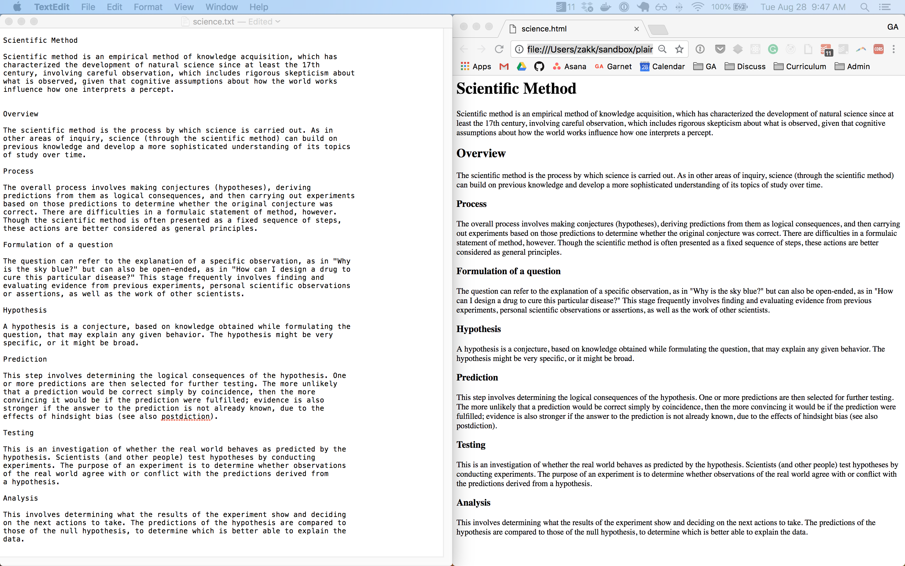

[](https://generalassemb.ly/education/web-development-immersive)

---

Title: Introduction to HTML & CSS<br>
Duration: 3hrs+<br>
Competencies: Basic familiarity with HTML/CSS<br>
Prerequisites: Prework<br>

---

# Intro to HTML & CSS

Our first official foray in to the world of web development will be to learn
HTML & CSS. There are three components to every website: `HTML, CSS, and JavaScript`.
Each `ingredient` has a specific function, for HTML it's the content and
structure of the webpage and for CSS it's all about styling. They are the the two tools that allow developers the visual content in unique and different ways.

## Prerequisites

- The SEI prework

## Objectives

By the end of this you should be able to:

- Write HTML elements, including tags that are assigned attributes
- Build out the skeleton for a webpage using the HTML5 boilerplate
- Target specific HTM elements in CSS and add styling
- Convert a design/mock up into an HTML document

## Introduction

There are three `ingredients` to every website: HTML, CSS, and JavaScript:

| Ingredient | Purpose             |
| ---------- | ------------------- |
| HTML       | Content & Structure |
| CSS        | Styling and Layout  |
| JavaScript | Interactivity       |

The focus of this lecture will be on the first two: HTML and CSS.

### Intro To HTML and CSS

#### HTML for Content and Structure

The purpose of HTML is very functional, we want to annotate text to give that
text meaning. You can see what we mean by comparing a document containing plain content that outlines a GA Press Release and then compare that with the same document written in HTML:

<!--  -->


<hr>

#### <g-emoji class="g-emoji" alias="alarm_clock" fallback-src="https://github.githubassets.com/images/icons/emoji/unicode/23f0.png">⏰</g-emoji> Activity - 2min

- Take a moment to examine the site and based on what you know about creating documents using MS Word or Google Docs
- Think of at least 3 of the types of content you see.
- You will be asked to post your thoughts in a slack thread they create.

<hr>

**Activity Recap**

In the plain text example it's hard to visually distinguish the type of content and what it represents. However some content based solely on it's position might indicate what it represents like a list of places in a vertical column. However with just a touch of HTML we can highlight that content and give it some structure that users recognize fairly easily. 

So when someone says HTML is the `structure` of a webpage and is used to organize the `content` that's what they mean!

#### CSS for Styling

Now take that same content, add some css and you can make it come to life. The following versions the press release were created by students just like yourself.

As we can see the same theme images are used that are used to convey GA is a company about education. Also the GA logo itself has been used in several place to remind the reader this is a GA press release.


### Investigating Web Sites Using Chrome DevTools

We will be using `Chrome` as the default browser for the entirety of the cohort so open `Chrome` now. 

One of the main tools that front end developers use to investigate web sites in order to inspect html elements and css is `Chrome Developer Tools` or `DevTools` for short.

Although DevTools provides a list of tools to work with we will mainly use it for the following:

- View the HTML layout of a web site
- Copy entire HTML sections and supporting CSS
- Make changes to CSS and see the page immediately update
- Learn about what technologies are being used to support the site
- Run and debug JavaScript


### Open the DevTools

To access DevTools use the following command shortcuts:

- `⌘ + ⌥ + i` to open the DevTools on Elements tab
- `⌘ + ⌥ + j` to open the DevTools on the Console tab

If you forget these commands, you can always go to `View > Developer > Developer Tools`.

Let's take a look at a deployed version of the most basic [GA Press Release](http://press-release-basic.surge.sh) and use DevTools to investigate.

#### DevTools Tabs

Overall, there are eight main tools available in the DevTools. There are also additional extensions that we can install like React DevTools.  

We won't use all of these tabs during the course and the key ones we will work with with are:

- **Elements** 
- **Sources** 
- **Console**

#### Sources Tab

Let's start with the `sources` tab as it contains all the files and supporting assets that the user needs to view the web site in the browser.


What we see are the `index.html` and `styles.css` files. Since this doesn't yet have any custom styling applied that file is currently is empty.

Now let's compare that to this portfolio website created by a previous SEIR student: [https://carlynicholson.github.io/portfolio/](https://carlynicholson.github.io/portfolio/).

As you can see this site contains more than just HTML but also: `CSS & JS`.


#### Elements Tab

Today our focus will be on the `Elements` tab which can be use for a variety of tasks:

- Inspecting the HTML & CSS of a web page
- Live-editing HTML & CSS on-the-fly

Let's revisit the the GA Press Release again and look at it in the elements tab:


As we can see there are many elements being used to create the entire HTML structure.

### HTML Pages

A web page is defined in an HTML document, ending with an `.html` extension .
But an HTML page is more than just an `.html` extension. It also needs several elements that defines it as an HTML document.

```html
<!DOCTYPE html>
<html>
	<head>
		<meta charset="utf-8" />
		<title>This is the title</title>
	</head>
	<body></body>
</html>
```

The main elements are:

- `DOCTYPE `
- `html`
- `head`
- `body`

**Review Questions:**


<details>
  <br>

  <summary>What does <code>!DOCTYPE html</code> do?</summary>

<code>!DOCTYPE html</code> declares that the document is an HTML5 document. Previous versions of HTML used a slightly different syntax.

</details>
  <br>
<details>
  <br>
  <summary>What is the <code>html</code> tag used for?</summary>

The next line opens the top level element, <code>html</code>, which represents
the entire document. This is the only top level element and spans the whole
document. The closing <code>html</code> tag should be the last line of the page.

</details>
  <br>
<details>
  <br>
  <summary>What information goes inside of the <code>head</code> tag? What about
  the <code>body</code> tag?</summary>

The <code>head</code> element holds metadata about the document and imports supporting css and js.

The <code>body</code> element is for the contents of our document. We're going
to write our own HTML between the opening and closing <code>body</code> tag.

</details>

### Nesting Tags to Build Webpages

So we've discussed tags in isolation and we've discussed the overall webpage as
a whole. How do the two come together to make a webpage?

Sites are a combination of different layouts that require several layers of nesting.

```html
<section>
	<p>
		Something about news:
		<a href="http://www.cnn.com">CNN</a>
	</p>
</section>
```

Here a `section` element is being used to contain a `p`, which itself contains an `anchor` tag. 

## HTML tags and attributes

The following will all be review from the prework. That's okay though, because
learning is iterative (meaning each time you review something, you learn
a little more and you learn it a little deeper).

And besides, if you had to rebuild the prework project from scratch without looking at your previous project how well do you think you would do?

### Anatomy of a Tag

From the prework, we know that an HTML tag looks like this:

```html
<p>Content</p>
```

The tag in the snippet above has both an opening and a closing tag - a tag that
marks the beginning of some content and a _separate tag_ that marks the end of
that content. In this case, the tags mark the begging and ending of a paragraph.

#### Self-closing Tags

As we learned in the prework, not all elements are made with an opening and
a closing tag; some elements are made with _self-closing_ tags such as an `img`

```html

```

<hr>

### <g-emoji class="g-emoji" alias="alarm_clock" fallback-src="https://github.githubassets.com/images/icons/emoji/unicode/23f0.png">⏰</g-emoji> Activity - Review Questions

- When looking at the snippet, how do we know it's self closing?
- What is `src="cat.gif"` in relation to the tag? 
- Is this unique to self-closing
  tags?

<hr>

#### Attributes

The code snippet above includes two HTML attributes: the `src` and `alt`.
Attributes are essentially properties that are assigned data . So for an `img` tag, the `src`attribute tells the browser the source of the image we want to display and the `alt` is what's displayed if the images isn't available. 

Below is another example of an element that requires an attribute. 

```html
<a href="http://www.google.com">Google</a>
```

<hr>

### <g-emoji class="g-emoji" alias="alarm_clock" fallback-src="https://github.githubassets.com/images/icons/emoji/unicode/23f0.png">⏰</g-emoji> Activity - Review Questions


- What type of element is this?
- What is the purpose of `href="http://www.google.com"`?
- Can you see a pattern in how tags and attributes work?

<hr>

#### Common Tags

There are 113 HTML tags in the HTML specification - that's a lot but for the most part
you'll only use a handful of them day-to-day.

Let's take a look at [W3Schools](https://www.w3schools.com/tags/ref_byfunc.asp) and review a few categories and their tags:

- Basic HTML
- Lists
- Styles and Semantics
- Meta


Don't worry about memorizing any of these (unless you want to). Instead, learn them as you go!

#### Search Engine Optimization (SEO) Tags

Beside using the tags we just previously discussed, Front End Developers also have to keep in mind how best to implement SEO. 

We won't be delving into SEO in this class and once you are able to build scalable/responsive web apps you will have time to focus on how best to leverage the following tags for SEO

- Meta
- Title
- Header
- H1


### From Mockup To Implementation

As a developer it's your job to build the design based on mockups. The UX team that worked on those mockups have done their due diligence in choosing specific elements, layouts and colors based on hours of research and user testing.

Although we don't have a team of designers on hand, we can rebuild something that is already beautifully designed. Being that you ae just starting out with `html/css` it's best to focus on small and build up and out from there. One activity that I enjoy doing is rebuilding previous Instagram quotes.

Here are a few examples below and there are several more posted here: [newbieandthepro](https://www.instagram.com/newbieandthepro/)


<br>
<br>

<hr>

### <g-emoji class="g-emoji" alias="alarm_clock" fallback-src="https://github.githubassets.com/images/icons/emoji/unicode/23f0.png">⏰</g-emoji> Activity - 10min

For this activity you will be placed in breakout rooms and examine the mockup provided and see if you and your peers can come up with a few HTML elements that might be used to implement the design.


In the breakout rooms discuss with your peers the following:

- What elements could be used to implement the design?
- What parent and child elements would be best suited?
- How would you target the three keywords of `Smile, Give, Love`?

Deliverables are:

- Fork and update this CodePen [CodePen](https://codepen.io/jkeohan/pen/WNwwdaE) with the HTML design decided upon by the group
- Click on the thumbs up posted in slack when you believe you are done
- When you return you will be asked to post the html in a slack thread as a code snippet

**Note:** There is no need to style the elements at this time. This activity is meant to have you think about only which elements could be used to implement such a basic design.

`Breakout Rooms Activate!!! ==>`

<hr>

## Implementing a Design

<!-- To see the HTML elements we've learned in action, we're going to build out the
HTML for a common piece of a webpage: a header navigation.

The exercise we're going to work through together is [in this
repository](https://git.generalassemb.ly/dc-wdi-fundamentals/nav-bar) -->

Together we will create the design in the above mockup using HTML & CSS. Although we will be using VSCode for the majority of the class for this particular exercise we will use a `CodePen` as this will allow for easy sharing and troubleshooting.

Fork this CodePen (if you haven't already done so): [Smile-Give-Love Starter CodePen](https://codepen.io/jkeohan/pen/WNwwdaE)

#### Starting Over

As painful as it might sound, delete any previous code that you and your team came up with as we will be building this design during the lecture and those elements have already been decided.

### HTML Boilerplate

The first thing to do is to add the HTML boilerplate. Since every web site requires a basic HTML template CodePen provides a shortcut to create that:

`! + tab` = Default HTML Structure

#### Head

The head element contains several tags that either provide additional information about the site or are used to link to additional supporting files. The tags that are imported by default are:

- `title`
- `meta`

The title element defines what shows up in the browser tab and what the page is titled in search-engine results.

The 2 `meta` tags added by default are:

- `charset` - set of characters used in this document of which utf-8 includes most characters from all known human languages.

```html
<meta charset="UTF-8" />
```

- `viewport` - sets the width of the area in which the content renders (the viewport) to the width of the device and sets the scale to 1.

```html
<meta name="viewport" content="width=device-width, initial-scale=1.0" />
```

Other important tags that we will add later this week week are:

- link - primarily used to link and import css 
- script - used to link and import JavaScript 

```html
<link rel="stylesheet" href="styles.css">
<script src="app.js"></script>
```

Once you start investigating other web sites you will see just how many of these tags are needed to support a web site.

<hr>

### <g-emoji class="g-emoji" alias="alarm_clock" fallback-src="https://github.githubassets.com/images/icons/emoji/unicode/23f0.png">⏰</g-emoji> Activity - 2min

Let's quickly look at [https://mars.nasa.gov/](https://mars.nasa.gov/) in DevTools. 

Below is just a snapshot of what was in the head and as we can see it contains much more info than the default HTML added by CodePen.  

This is essential info regarding the site which is used to support the site and used by search engines to determine the relevancy of the site.


<hr>

#### Body

The body element contains the information actually viewable to the user; it represents the content of the document.

Let's add the following content to the body:

```html
<article>
	<p>smile...</p>
	<p>more than you cry.</p>
	<p>give...</p>
	<p>more than you take.</p>
	<p>love...</p>
	<p>more than you hate.</p>
</article>
```

Although `p` tags we are already familiar with, why did we choose an `article` element as the parent?

<hr>

### <g-emoji class="g-emoji" alias="alarm_clock" fallback-src="https://github.githubassets.com/images/icons/emoji/unicode/23f0.png">⏰</g-emoji> Activity - 2min

Lets take a look at [W3Schools](https://www.w3schools.com/tags/ref_byfunc.asp) and see what an article represents.

> The `<article>` tag specifies independent, self-contained content. An article should make sense on its own and it should be possible to distribute it independently from the rest of the site.

The `article` tag is part of a larger grouping of HTML elements called `Semantic` Elements.

<hr>


#### Semantic HTML

New [semantic HTML elements](https://www.w3schools.com/html/html5_semantic_elements.asp) were introduced in HTMLv5. You will be using many of these elements extensively in the weeks to come as we the we build apps that contain more content and require additional layers of structure.


The amount of elements might seem overwhelming but here is a chart that helps walk you through the decision process for some of them.


### CSS (Cascading Style Sheets)

Now onto the fun stuff...`CSS`.

### Comparing Websites Designs

So far the design we've created has no CSS and is no better then a plain text file.

<hr>

### <g-emoji class="g-emoji" alias="alarm_clock" fallback-src="https://github.githubassets.com/images/icons/emoji/unicode/23f0.png">⏰</g-emoji> Activity - 5min

#### Beautiful Designs

Let's take a look at the true power of css and what it can do by visiting: [CSS Zen Garden](http://www.csszengarden.com). 

This site provides developers static HTML content which they are not allowed to edit but have the freedom to use CSS in any capacity to implement their own design using the existing content.

#### Not So Beautiful Design

It goes without saying that not everyone has the eye for design and it seems the developers at [https://www.lingscars.com/](https://www.lingscars.com/) might fall into that category.

<hr>

### Basic CSS

The first thing you should learn to do when you first start working with a design is to put borders around everything. That way you can see an elements dimensions and how its position relates to the other elements around it.

**Target A Single Element**

Now we could target both the `article` and `p` tag separately as such:

```css
article {
	border: 1px solid;
}

p {
	border: 1px solid;
}
```


**Grouping**

Or we could target both elements by grouping them. This way we can limit the amount of css we write as well as make it much easier to change one rule which then updates multiple elements.

```css
article, p {
	border: 1px solid;
}
```

**The Wild Card**

Our last option is to use the `wildcard` and target all elements as grouping 5, 10, 20 elements will not be realistic. 

We also highly suggest you take this approach anytime you are working on a lab/hw or even you unit projects. 

```css
* {
	border: 1px solid;
}
```
But wait...it seems that we have now added border around some additional elements?

**Question:**  What additional elements are they?

#### Dimensions (Width & Height)

The dimensions of the container are clearly outlined in the mockup so let's apply them to the article.

```css
article {
	width: 500px;
	height: 360px;
}
```

#### Fonts and Text

Our design incorporates a cursive font with is one of the [5 generic font's](https://www.w3.org/Style/Examples/007/fonts.en.html) available on most browswers.

Let's add a `font-family` and `font-size`  to all the `p` elements:

```css
p {
	font-size: 25px;
	font-family: cursive;
}
```
**The 3 Main Keywords**

Now let's deal with targeting the 3 main key words. In order to do this were going to edit the HTML and add `span` element around each word.

Spans are great for targeting text within a larger block of text. Here is a [good example](https://codepen.io/jkeohan/live/vqpyZG) of doing just that.

Let's add our spans.

```html
<article>
	<p><span>smile...</span></p>
	<p>more than you cry.</p>
	<p><span>give... </span></p>
	<p>more than you take.</p>
	<p><span>love... </span></p>
	<p>more than you hate.</p>
</article>
```

**Question:** After we adding the spans what has changed and why?


This delves a bit further into a larger topic of the `display` property and how all elements are assigned one of 3 display properties by default:

- block
- inline
- inline-block

This is where DevTools comes in really handy. It allows us to look at all the properties and values assigned to elements. So in DevTool highlight and element and on the right side click on `Computed` and type `display`


Going into the differences between these properties is a much larger discussion which will be discussed in another lecture but for now just know the following:

- block - takes up entire width of horizontal space and can be assigned height, width, margin
- inline - takes up only the space it needs, shares horizontal space with other elements and cannot be assigned width, height, or margin (top or bottom)
- inline-block - best of both wolds

So with our spans in place let's add the following CSS. 

```css
span {
	font-size: 35px;
	font-weight: 600;
	text-transform: uppercase;
	color: salmon;
}
```


**Targeting Text**

The last few settings are related to text will be applied to the the article element.

```css
article {
	text-align: right;
	letter-spacing: 1.5px;
	line-height: 1;
}
```


These settings can be combined is so many different ways and the [CSS Font Sytle Generator](https://html-css-js.com/css/generator/font/) tool allows you to do just that.

### Changing CSS in DevTools

Before we go on and add additional CSS to complete the design let's try modifying and editing the existing CSS in dev tools. It's the best tool available where we can explore different CSS settings, see what works and then add them in the CSS file.

#### Exploring Additional Font Colors

So let's say we wanted to work through some additional colors and apply them to the spans. In DevTools we would highlight the element and on the `Styles`tab we could select the css rule that targets that element and make the change there.


We also might just want to target that specific element only and we could do so using `element.style` and add the rule declaration there.

Let's target all spans for now and click on the color. This should open up a control panel where we can explore different colors.


Notice how DevTools has converted the named color `salmon` into it's hex color of `#fa8072`. All named colors have a corresponding hex equivalent but not vice versa as hex provides over 16 million+ possible options while named only [140](https://www.w3schools.com/colors/colors_names.asp).

#### Finding The Right Color

In the final design `SMILE` is assigned a unique shade of purple.


<br>

<hr>

### <g-emoji class="g-emoji" alias="alarm_clock" fallback-src="https://github.githubassets.com/images/icons/emoji/unicode/23f0.png">⏰</g-emoji> Activity - 2min

- Play with the color wheel and see if you find an exact match
- When asked post your finding in the slack thread provided by the instructor.

<hr>

**ColorZilla**

I'm sure some of you got pretty close and maybe even nailed the exact color. But for the same of matching the design exactly try using the following hex: `#c99cd5`

Ok so it's an exact match and anytime your working with the UX Designers they will always provide the colors as per the design specs. But what if you saw a color on a site and wanted to know that color exactly. Lucky for use Chrome comes will tons of extensions one of which is: [ColorZilla](https://chrome.google.com/webstore/detail/colorzilla/bhlhnicpbhignbdhedgjhgdocnmhomnp?hl=en)

Once installed it will add a dropper icon to your chrome extensions and with it we can pick a color from a page:


<hr>

### <g-emoji class="g-emoji" alias="alarm_clock" fallback-src="https://github.githubassets.com/images/icons/emoji/unicode/23f0.png">⏰</g-emoji> Activity - 2min

- With our new tool pick the two additional colors we need for the design
- When asked post your finding in the slack thread provided by the instructor.

 <hr>

<details>
<summary>Our Full Color Palette</summary>
<br>

- Smile: #c99cd5
- Give: #b1a983
- Love: #7fac8b
</details>

### Targeting Specific Elements Using Pseudo-Class & Classes

With our color palette in place we are now faced with how to apply those unique colors directly to their corresponding key word. There are several options we can take:

- use [pseudoclasses](https://www.w3schools.com/css/css_pseudo_classes.asp) in css (no need to edit html)
- use classes to target those elements and any others that need that color
- use id's to target each element individually

#### Pseudo-class

Let's try with pseudo-classes first. Pseudo-classes are used to apply settings based either a state of the elements, such as when a user `hovers` over an element or it's position in the HTML. In order to target `SMILE` we will go the route of selecting it's position and then the span within it.

```css
p:first-of-type span {
	color: #c99cd5;
}
```

That should do it.

<hr>

#### <g-emoji class="g-emoji" alias="alarm_clock" fallback-src="https://github.githubassets.com/images/icons/emoji/unicode/23f0.png">⏰</g-emoji> Activity

- Take a moment to experiment with some of the pseudo-classes and see if you can target just the second keyword `GIVE`.
- For the record there is no `:second-of-type` pseudo-class
- When asked post your finding in the slack thread provided by the instructor.

<hr>

<details>
<summary>Solution</summary>

<br>
There are two possible ways to target that element.

```css
// nth-of-type()
p:nth-of-type(3) span {
	color: #b1a983;
}

// nth-child()
p:nth-child(3) span {
	color: #b1a983;
}
```

</details>
<br>

Ok so let's work with the above solution and apply one to the keyword `GIVE` and the other to the `LOVE`.

```css
p:first-of-type span {
	color: #c99cd5;
}

p:nth-of-type(3) span {
	color: #b1a983;
}

p:nth-child(5) span {
	color: #7fac8b;
}
```

Ok so now that you understand the power of using only CSS to target specific elements let's try the same using `classes`

#### Classes

Although the above approach works, colors represent a style that is most often applied to multiple elements on a page, and although we only are targeting those elements we need to think long term and for the growth of our app. So let's take that approach and assign each color a `class` and name the class the keyword.

This requires that we edit the HTML so let's do that first. Since the `p` contains only a single `span` and no additional text we can assign the class to the `p`.

```html
  <article>
    <p class='smile'><span>smile...</span></p>
    <p>more than you cry.</p>
    <p class='give'><span >give... </span></p>
    <p>more than you take.</p>
    <p class='love'><span >love... <span/></p>
    <p>more than you hate.</p>
  </article>
```

Now let's target those classes in CSS.

```css
.smile {
	color: #b1a983;
}

.give {
	color: #b1a983;
}

.love {
	color: #7fac8b;
}
```

We shouldn't see any change at this point as the previous pseudo-class rule declarations are still in effect. 

But the question now is which of the below rules is actually taking affect?

```css
p:first-of-type span {
	color: #b1a983;
}

.smile {
	color: #b1a983;
}
```

In order to test things out let's change the color of `p:first-of-type span` to be `red` and see if it has any effect.

```css
p:first-of-type span {
	color: red;
}

.smile {
	color: #b1a983;
}
```

So it looks like the first rule we created takes precedence. Let's discuss the topic of precedence a bit further

#### CSS Precedence

Rule specificity is an important concept in CSS and in this case one rule references 2 elements (p and span) and includes a pseudo-class while the other just a class

Rule specificity is an important concept in CSS and if you ever were curious about 2 rules and which one is more specific you could always use the [CSS Specificity Calculator](https://specificity.keegan.st/)

If we test the two rules we will see that one is more specific.


But if add some additional elements we can even the playing field.

```css
p:first-of-type span {
	color: red;
}

p.smile span {
	color: #b1a983;
}
```


Now that we have 2 rules with the same specificity it comes down to when they are read in the CSS. The rule is this:

> If two css rules have the same specificity then the last one read will apply

So if we move `p.smile span` above the other rule than it will take affect.

```css
p.smile span {
	color: #b1a983;
}

p:first-of-type span {
	color: red;
}
```

Since the goal of this lecture is to work through the way to assign css and we already have the class name written in HTML let's clean up our CSS and comment out all the previous references to pseudo-classes and simplify our CSS paths by removing the all additional elements except for the class name.

Our CSS code to target those elements will now look like this:

```css
/* p:first-of-type span {
  color: #c99cd5
}

p:nth-of-type(3) span {
  color: #b1a983
}

p:nth-child(5) span {
  color: #7fac8b
} */

.smile {
	color: #c99cd5;
}

.give {
	color: #b1a983;
}

.love {
	color: #7fac8b;
}
```

Ok...what just happened. One minute it was working and the next it's not. Any ideas?

If you remember we initially assigned all spans a color of salmon and of course that rule is taking precedence so let's remove it. The span should look like the following:

```css
span {
	font-size: 35px;
	font-weight: 600;
	text-transform: uppercase;
}
```

Now were onto images.

### Images

As humans we are a visual species and enjoy looking at things that capture our attention. Of the handful of edits left for this project adding the image is what we will do next.

There are two ways to add images:

- `` tag
- using the `backround-image` property

#### Image Tags

Images require a `src` with a URL for an image. You should also include an `alt` tag for screen readers, or for when the image isn't available.

Images are empty elements meaning that they cannot logically have children. They are represented in HTML with a single, self-closing element.

```html

```

If we add an image tag to our design then it would require many more CSS settings to work it into place and those settings are lectures all on their own. But let's add an image tag and confirm it's not the way to go.

```html
<article>
	
	<p class="smile"><span>smile...</span></p>
</article>
```

If we add just an empty image then we can already see that it has an effect on the current content.


Let's even go so far as to add the actual background image and see what it would do. 

For simplicity just copy the below img tag and paste into your HTML.

```html

```

As we can see the image has dimensions and takes up width and height. Our design however applies an image as a background so lets set that up. 

Go ahead and comment out the image tag for now.

#### Background Images

Background images are a great way to add images and are often used to add layers to the some visual display of content, as in the Instagram quote we are building.

CSS provides the [background property](https://www.w3schools.com/cssref/css3_pr_background.asp) which comes with several options, the most common are:

- background-color
- background-image
- background-position
- background-size
- background-repeat

Since we are applying an image it seems that `background-image` might be the way to go.

```css
article {
	background-image: url('https://images.unsplash.com/photo-1516452391242-15957b3bb26a?ixlib=rb-1.2.1&ixid=eyJhcHBfaWQiOjEyMDd9&auto=format&fit=crop&w=500&q=60');
}
```


Not quite what we had in mind. It seems the most important part of the image isn't being displayed. This is because background images start from the top left and apply their full dimensions to an element. Since the actual container is much smaller the image itself much of the image is being cut off.

<hr>

#### <g-emoji class="g-emoji" alias="alarm_clock" fallback-src="https://github.githubassets.com/images/icons/emoji/unicode/23f0.png">⏰</g-emoji> Activity

- Review the documentation for the `background `property.
- Try and determine which property can be used to move the bouquet of flowers.
- When asked post your finding in the slack thread provided by the instructor.

<hr>

<details>
<summary>Solution</summary>

```css
article {
	background-image: url('https://images.unsplash.com/photo-1516452391242-15957b3bb26a?ixlib=rb-1.2.1&ixid=eyJhcHBfaWQiOjEyMDd9&auto=format&fit=crop&w=500&q=60');
	background-position: 0px -400px;
}
```

</details>

<br>


It seems like all we have left to do is position the text so let's do that.

### Dimensions (Margins)

Earlier in the lesson we added width & height to the article. That locked in the size and made it easier to position the image and now will do the same for the text.

A major concept in CSS which encapsulates content, padding, border and margin is called the [Box Model](https://i.imgur.com/xixIhCh.png).


The properties that define the box model are:

- Content - The content of the box, where text and images appear
- Padding - Clears an area around the content. The padding is transparent
- Border - A border that goes around the padding and content
- Margin - Clears an area outside the border. The margin is transparent

#### Padding vs Margin

One of the biggest questions, as per the box model, is when do we make the decision to use padding vs margin.


They both are used to create gaps around elements, but they differ in their method of creating that gap. 

Margin accommodates the gap by pushing away from adjacent elements, while Padding accommodates the gap by adding space withing the element. 

Use Padding when:

- You don't want the content to touch the edges of the container
- You want the background of the element to be displayed
- You want to increase the size of an element that perhaps can't be assigned width or height like a button

Use Margin when:

- You want to create space around the elements
- You want to center aan element using `margin:auto`

#### Padding

Padding is used to create space within an element. Let's take a look at developer tools and examine the final live version of the Instagram quote and see if we can determine what padding has been defined.

[Live Instagram Quote](https://codepen.io/jkeohan/live/oNXVowv)

If you hover over the article element you should the following:


If you also click on the `Computed` tab you will see all the dimensions applied to the article


Before we apply the padding let's consider our options on how to use the padding property to apply it. Since padding surrounds the element it makes sense that we could target padding for left, right, top, bottom.

**The Really Long Way**

It's possible to target all those dimensions of padding by writing it this way.

```css
padding-left: 10px;
padding-right: 10px;
padding-top: 55px;
padding-bottom: 55px;
```

**Much better**

Although a much better way to write the above would be to target top/bottom and left/right together since they have the same values.

```css
padding: 10px 55px;
```

Of course were all about efficiency and that is how we are going to add our padding.

```css
article {
	border: 1px solid black;
	width: 500px;
	height: 360px;
	background-image: url(https://images.unsplash.com/photo-1516452391242-15957b3bb26a?ixlib=rb-1.2.1&ixid=eyJhcHBfaWQiOjEyMDd9&auto=format&fit=crop&w=500&q=60);
	background-position: 0px -400px;
	padding: 55px 10px;
}
```

What you should immediately notice is that the entire article element just expanded. It seems as though if we add padding that will increase the width and height of an element. 

This obviously can cause issues in our design so we need to fix that by addinng [box-size: border-box](https://www.w3schools.com/css/css3_box-sizing.asp).

This setting allows us to include the padding and border in an element's total width and height. Since we would like to keep the exact heights and widths defined on all elements we will apply this setting to the wild card.

```css
* {
	border: 1px solid;
	box-sizing: border-box;
}
```

It seems that fixed one issue but caused another as our design looks like this now where the content is bleeding outside of the article.


Were going to use margin to fix this.

#### Margin

The CSS margin properties are used to create space around elements, outside of any defined borders. They can be used to push away from another element or pull toward it and use the same sub properties as padding (left/right/top/bottom).

<hr>

#### <g-emoji class="g-emoji" alias="alarm_clock" fallback-src="https://github.githubassets.com/images/icons/emoji/unicode/23f0.png">⏰</g-emoji> Activity - 2min

- Examine the `p tags` in DevTools
- Determine if margin is being applied to them, and if so, from where?
- When asked post your finding in the slack thread provided by the instructor.

<hr>

<details>
<summary>Answer</summary>

It's coming from the default CSS that is applied right from the start.


</details>
<br>

Lets remove all that default margin that we never added in the first place.

```css
p {
	font-size: 20px;
	font-family: cursive;
	margin: 0;
}
```

'

Now let's use margin to move the text into place. We will start with `SMILE` and push away from the right side.

```css
.smile {
	color: #c99cd5;
	margin-right: 100px;
}
```


Adding `100xp` to `GIVE` will also do the trick but `LOVE` will needs just a little more push in the right direction to get it into place.

```css
.give {
  color:#b1a983;
  margin-right: 100px;
}
}

.love {
  color:#7fac8b;
  margin-right: 125px;
}
```


#### Finishing Touches

Let's create space between the grouping of large and small text and for that we are going to edit the HTML to add break (`<br`) tags. We could opt to tweak additional css but this represents a good opportunity to introduce a new tag.

```html
  <article>
    <p class='smile'><span>smile...</span></p>
    <p>more than you cry.</p><br>
    <p class='give'><span>give... </span></p>
    <p>more than you take.</p><br>
    <p class='love'><span>love... <span/></p>
    <p>more than you hate.</p>
  </article>
```

Let's comment out the border

```css
/* * { border: 1px solid} */
```

And assign the following color to the p elements.

```css
p {
	color: #eae3d9;
}
```

Perhaps we should assign a different font family to the key words to make them stand out.

```css
span {
	/*  additional css  */
	font-family: fantasy;
}
```

### Final Design

Congratulations!! You've created your very first Instagram Quote. Needless to say that there are several online tools that allow you to create the same design with to little to no learning curve.

The advantages however of learning to use HTML & CSS to create a one off piece of art now provide you the skills to create full blow website with much more complexity in layout and design.


<hr>

#### <g-emoji class="g-emoji" alias="alarm_clock" fallback-src="https://github.githubassets.com/images/icons/emoji/unicode/23f0.png">⏰</g-emoji> Activity - 10min

- The instructor will spin up a Kahoot and slack out the code to the class
- You will to to `kahoot.it` and put in the code
- Play the game by answering the questions to the best of your ability

<hr>


### Additional Resources

- [When Do I Use Background vs Img Tag](https://buildawesomewebsites.com/html-img-vs-css-background-image/)
- [The Difference Between Id-and-Class](https://css-tricks.com/the-difference-between-id-and-class/)
- [Margin vs Padding](https://medium.com/frontendshortcut/margin-vs-padding-c1fc8ea8bfaf)
- [Taming Advanced CSS Selectors](https://www.smashingmagazine.com/2009/08/taming-advanced-css-selectors/)
- [How to use HTML5 Sectioning Elements](https://blog.teamtreehouse.com/use-html5-sectioning-elements)
- [How To Use The Header Tags: SEO Best Practices](https://www.searchenginejournal.com/on-page-seo/header-tags/#close)
- [HTML Tags for SEO](https://neilpatel.com/blog/html-tags-for-seo/)
